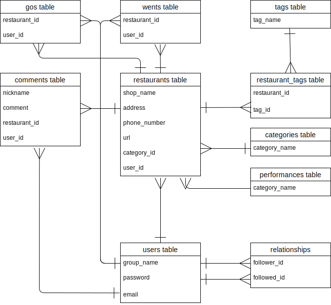

# アプリケーション名
Share Restaurant

# アプリケーション概要
行きたいレストランを管理し、友人と共有することができます。
友人が登録した店と、自分が登録した店をまとめて表示することができるため、店選びの時間を短縮することができます。

# URL
http://3.114.188.138/

# テスト用アカウント
ゲストログイン可能です

- Basic認証

| ID       | pass    |
| -------- | ------- | 
| admin    | 2222    |

- テスト用アカウント

| user     | email    | password     |
| -------- | -------- | ------------ |
| reina    | 1@test   | test1111     |
| rino     | 2@test   | test2222     |
| moe      | 3@test   | test3333     |

# 利用方法
自分が登録した店を管理するマイページと、友人と店を共有するシェアページを利用できます
## マイページ
- emailとパスワードを入力してログインする
- ログインユーザーが登録した店一覧が表示される

店の登録
- サイドバーの登録するボタンから店を登録する
- タブレット、スマートホンからアクセスする場合は、右上のメニューをクリックするとサイドバーが表示される

友達追加
- サイドバーの友達追加ボタンからユーザーをフォローする
- フォローユーザー一覧はサイドバーに表示される
- フォローしたユーザーが登録した店はシェアページで見ることができる

## シェアページ
- マイページサイドバーのシェアページをクリックする
- ログインユーザーとフォローしたユーザーが登録した店一覧が表示される

## 共通機能
店探し
- サイドバーの検索フォームから、店名で店を探す
- サイドバーの駅名から、駅店で店を探す
- カテゴリーを選択して表示されている中から店を絞る
店詳細情報
- 一覧表示の店名をクリックし、詳細ページで登録情報を確認する

# アプリケーションを作成した背景
友人と私自身の中にある課題を解決するために、アプリを作成しました。
前提、私は友人と食事に出かけるのが好きで、店選びの際にグルメサイトを利用していました。
ですが、何百件もの店から良さそうな店をピックアップしてlineで送り合うのが手間で、毎回時間がかかっていました。
そこで、複数人の友人が登録した店をまとめて表示し、その中から選ぶことができれば時間短縮になると考え、開発することにしました。

# 工夫した点
工夫した点は大きく3つあります。

- 店登録の簡易化
店を登録する際、入力に手間がかかると気軽に登録できないため、食べログサイトの「送る」に記載している内容をコピー&ペーストすれば、店名・住所・電話番号・食べログURLが自動で入力できる機能を追加しました。

- 駅ごとに店を表示することができる
私自身、友人と店選びをする際、駅を決めてからレストランを探すことが多いため、駅ごとにレストランを表示できる機能を追加しました。

- line共有機能
アプリを利用していない友人にも店情報を共有できるように、line共有機能を追加しました。

また視覚的に登録されている店を確認できるように、Googleマップ表示機能を追加、スマートホンで利用することを想定して、レスポンシブデザインにも工夫しました。

# 要件定義
https://docs.google.com/spreadsheets/d/1eEnprWBhlHt8YYFLLLEyMcp6rCqfiZ44ccCDMCSD0kU/edit#gid=982722306

# 実施した機能についての画像やGIFおよびその説明
## ログイン機能
GIF：ログインに成功し、マイページに遷移している様子。

## 自動入力機能
GIF：店登録の際、食べログの情報を貼り付け、自動入力ボタンをクリックすると、店名・住所・電話番号・食べログURLのフォームに値が自動で入力されている様子（非同期）。

## 店登録機能
GIF：登録が成功し、登録した店が追加されている様子（非同期）。

## フォロー機能
GIF：友達追加をクリックするとユーザー一覧が表示され、フォローするボタンをクリックするとフォローリストにユーザーが追加されている様子。

GIF：フォロー中のユーザーの横にはフォロー外すボタンが表示されており、クリックするとフォローリストからユーザーが削除されている様子。

## 店名検索機能
GIF：「鎌倉」と検索し、「鎌倉」を含むレストランのみ表示させている様子（シェアページ）。

## 駅名検索機能
GIF：横浜駅をクリックし、横浜駅で登録されたレストランを表示させている様子（シェアページ、非同期）。

## カテゴリー検索機能
GIF：プルダウンでフレンチを選択し、カテゴリーがフレンチの店のみ表示させている様子（シェアページ、横浜駅クリック後）。

## いいね機能
GIF：店のボックス内の行きたい・行ったボタンをクリックするとカウントが1増える様子（非同期）。

## 詳細ページ
GIF：店名をクリックすると店詳細ページに遷移する様子。フォローユーザーが登録した店の店詳細ページには、登録情報、ユーザー名、地図、Lineで送るボタン、行った・行きたいボタンが表示されている。

## 外部サイトへのアクセス
GIF：URLをクリックすると食べログサイトに遷移する様子。

## 店編集機能
GIF：ログインユーザーが登録した店の詳細ページには「店情報を編集」「店情報を削除」メモ一覧が追加されている。「店情報を編集」をクリックし、必要事項を入力して更新に成功すると、変更内容が反映されている様子（非同期）。

## 店削除機能
GIF：「店情報を削除」をクリックすると、店が削除されマイページに遷移する様子。

## コメント機能
GIF：フォームに入力し、送信ボタンをクリックすると一覧表示欄に追加される。削除ボタンを押すと一覧表示欄より削除される（非同期）。

## 電話機能
GIF：電話番号をクリックすると電話アプリが起動する様子。

## Line共有機能
GIF：「Lineで送る」ボタンをクリックするとLineアプリが起動される様子。

## Googleマップ表示機能
GIF：Googleマップにはページ内に表示されている店のピンが立っている。ピンをクリックすると店名が表示され、店名をクリックすると店詳細ページに遷移する様子。

## レスポンシブデザイン
GIF：タブレット対応

GIF：スマートフォン対応

# 実施予定の機能
- フォローユーザーの中から特定のユーザー(複数)に絞って店を表示することができる機能

# データベース設計

## users テーブル
| Column             | Type   | Options                   |
| ------------------ | ------ | ------------------------- |
| group_name         | string | null: false               |
| email              | string | null: false               |
| encrypted_password | string | null: false               |

### Association
- has_many :restaurants
- has_many :comments
- has_many :gos
- has_many :wents
- has_many :relationships
- has_many :reverse_of_relationships
- has_many :followings, through: :relationships, class_name: 'Relationship', source: :followed
- has_many :followers, through: :reverse_of_relationships, class_name: 'Relationship', source: :follower

## restaurants テーブル
| Column             | Type       | Options                        |
| ------------------ | ---------- | ------------------------------ |
| shop_name          | string     | null: false                    |
| address            | string     | null: false                    |
| phone_number       | integer    |                                |
| url                | string     |                                |
| category_id        | references | null: false                    |
| user               | references | null: false, foreign_key: true |

### Association
- belongs_to :user
- has_many   :comments
- belongs_to :category
- has_one    :performance
- has_many   :restaurant_tags
- has_many   :tags, through restaurant_tags
- has_many   :gos
- has_many   :wents

## categories テーブル
| Column             | Type       | Options                        |
| ------------------ | ---------- | ------------------------------ |
| category_name      | string     | null: false                    |

### Association
- has_many :restaurants

## performances テーブル
| Column             | Type       | Options                        |
| ------------------ | ---------- | ------------------------------ |
| latitude           | float      | null: false                    |
| longitude          | float      | null: false                    |
| restaurant         | references | null: false, foreign_key: true |

### Association
- belongs_to :restaurant

## comments テーブル
| Column             | Type       | Options                        |
| ------------------ | ---------- | ------------------------------ |
| comment            | string     | null: false                    |
| restaurant         | references | null: false, foreign_key: true |
| user               | references | null: false, foreign_key: true |

### Association
- belongs_to :user
- belongs_to :restaurant

## tags テーブル
| Column             | Type       | Options                        |
| ------------------ | ---------- | ------------------------------ |
| tag_name           | string     | null: false                    |

### Association
- has_many   :restaurant_tags
- has_many   :restaurants, through restaurant_tags

## restaurant_tags テーブル
| Column       | Type       | Options                        |
| ------------ | ---------- | ------------------------------ |
| restaurant   | references | null: false, foreign_key: true |
| tag          | references | null: false, foreign_key: true |

### Association
- belongs_to :restaurant
- belongs_to :tag

## relationships テーブル
| Column       | Type       | Options                        |
| ------------ | ---------- | ------------------------------ |
| follower     | references | null: false, foreign_key: true |
| followed     | references | null: false, foreign_key: true |

### Association
- belongs_to :follower, class_name: "User"
- belongs_to :followed, class_name: "User"

## gos テーブル
| Column       | Type       | Options                        |
| ------------ | ---------- | ------------------------------ |
| restaurant   | references | null: false, foreign_key: true |
| user         | references | null: false, foreign_key: true |

### Association
- belongs_to :restaurant
- belongs_to :user

## wents テーブル
| Column       | Type       | Options                        |
| ------------ | ---------- | ------------------------------ |
| restaurant   | references | null: false, foreign_key: true |
| user         | references | null: false, foreign_key: true |

### Association
- belongs_to :restaurant
- belongs_to :user

 
# 画面遷移図

# 開発環境
- フロントエンド

&emsp; HTML, CSS, JavaScript, jQuery

- バックエンド

&emsp; Ruby on Rails(Ruby)

- インフラ

&emsp; AWS(EC2, S3)

- OS

&emsp; Mac/Linux

- データベース

&emsp; MySQL/MariaDB

- タスク管理

&emsp; Github
